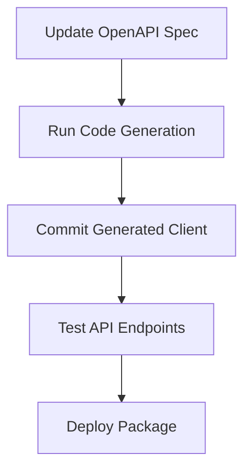

# @cloud-hub/api-client

**Type-Safe API Client for Cloud Ecosystem**  


## Features

- 🔄 **Auto-Generated Client** - Built with [orval](https://github.com/anymaniax/orval) from OpenAPI specs
- 🛡 **End-to-End Type Safety** - Full TypeScript support for requests/responses
- ⚡ **React Query Integration** - Ready-to-use hooks for seamless API interaction
- 🔧 **Zero Config Setup** - Works out-of-the-box with built-in defaults
- 🌐 **Environment Awareness** - Configure base URLs via environment variables

---

## Installation

```bash
# Using npm
npm install @cloud-hub/api-client

# Using yarn
yarn add @cloud-hub/api-client
```

---

## Quick Start

### React Component Example

```tsx
import { useGetUsersQuery, useCreateUserMutation } from "@cloud-hub/api-client";

function UserManager() {
  // Fetch users with auto-generated hook
  const { data: users, isLoading } = useGetUsersQuery();

  // Mutation hook for creating users
  const [createUser] = useCreateUserMutation();

  const handleSubmit = async (formData: UserForm) => {
    try {
      await createUser({ userData: formData });
      // Automatic cache invalidation
    } catch (error) {
      console.error("Creation failed:", error);
    }
  };

  return (
    <div>
      <UserList users={users} loading={isLoading} />
      <UserForm onSubmit={handleSubmit} />
    </div>
  );
}
```

---


### Environment Variables

```env
# .env.local
VITE_API_BASE_URL=https://api.cloudhub.com/v1
NEXT_PUBLIC_API_TIMEOUT=5000
```

---

## Development Workflow



**Regeneration Command:**

```bash
npm run generate:client
# or
yarn generate:client
```

---

## Error Handling

```tsx
const { error } = useGetUsersQuery();

if (error) {
  // Type-safe error handling
  if (error.status === 404) {
    return <NotFoundAlert />;
  }
  return <ErrorBox message={error.message} />;
}
```

---


## License

Distributed under the MIT License. See `LICENSE` for more information.

---

> **Pro Tip:** Use the `mock-server` package in development mode to test API endpoints without hitting real services:
>
> ```bash
> MOCK_API=true yarn dev
> ```
