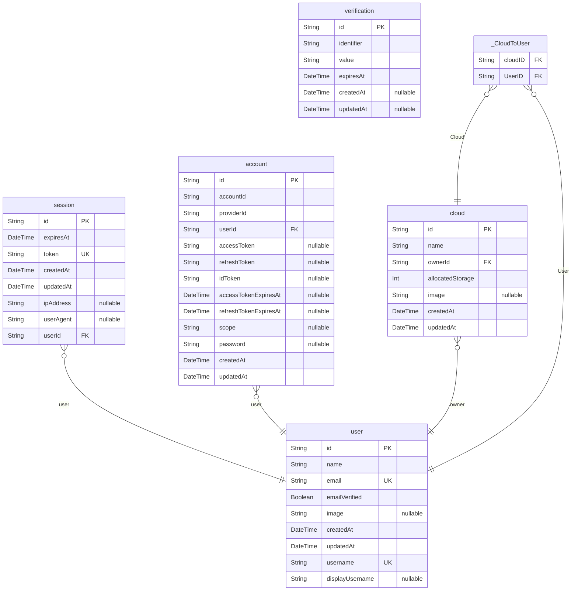

# Nimbus

> Generated by [`prisma-markdown`](https://github.com/samchon/prisma-markdown)

- [Nimbus](#nimbus)
- [user](#user)
- [session](#session)
- [account](#account)
- [verification](#verification)
- [cloud](#cloud)

### `user`

Every registered user in the database

**Properties**

- `id`: Primary Key
- `name`: Display name of user
- `email`: Email of user
- `emailVerified`: Has the email been verified
- `image`: Image URL, not required
- `createdAt`: Date, automatically given upon creation
- `updatedAt`: Date of the last update
- `username`: Username, normalized
- `displayUsername`: Username displayed to user

### `session`

Active user authentication session management.

**Properties**

- `id`: Primary Key
- `expiresAt`: Date when this session becomes invalid
- `token`: Unique session token string
- `createdAt`: Automatic creation timestamp
- `updatedAt`: Last update timestamp
- `ipAddress`: IP address of client (optional)
- `userAgent`: Browser/device user agent (optional)
- `userId`: Reference to associated User

### `account`

External authentication provider linkages and credentials.
Supports OAuth Connect providers and email/password auth.

**Properties**

- `id`: Primary Key
- `accountId`: Provider's account ID
- `providerId`: Authentication provider ID (e.g., "google", "github")
- `userId`: Reference to associated User
- `accessToken`: OAuth access token (encrypted)
- `refreshToken`: OAuth refresh token (encrypted)
- `idToken`: OpenID Connect token (encrypted)
- `accessTokenExpiresAt`: Access token expiration timestamp
- `refreshTokenExpiresAt`: Refresh token expiration timestamp
- `scope`: OAuth scopes granted
- `password`: Hashed password
- `createdAt`: Automatic creation timestamp
- `updatedAt`: Last update timestamp

### `verification`

Temporary verification tokens for email/phone validation from betterAuth

**Properties**

- `id`: Primary Key
- `identifier`: What is being verified (e.g., email address)
- `value`: Verification token/code
- `expiresAt`: Expiration timestamp
- `createdAt`: Creation timestamp
- `updatedAt`: Last update timestamp

### `cloud`

Represents a user's private or shared file space.

**Properties**

- `id`: Primary Key
- `name`: Display name for the cloud
- `ownerId`: Owner reference ID
- `allocatedStorage`: Storage capacity in megabytes
- `image`: Optional custom thumbnail image
- `createdAt`: Automatic creation timestamp
- `updatedAt`: Last update timestamp

### `_CloudToUser`

Pair relationship table between [cloud](#cloud) and [user](#user)

**Properties**

- `cloudID`:
- `userID`:
